# Use Cases for WEB-NPRU University Admission System

## Overview
This document outlines the primary use cases for the WEB-NPRU University Admission System, covering both applicant and administrator interactions with the system.

## Actor Definitions
- **Applicant**: A prospective student who wishes to apply for admission to the university
- **Administrator**: A university staff member who manages the admission process and system
- **System**: The WEB-NPRU application system

## Use Case Descriptions

### 1. Applicant Use Cases

#### UC-01: View Admission Information
**Primary Actor**: Applicant  
**Goal**: View general admission information and requirements  
**Preconditions**: None  
**Main Success Scenario**:
1. Applicant accesses the university website
2. System displays homepage with admission information
3. Applicant navigates to admission section
4. System displays admission requirements and process information

**Extensions**:
- 2a. If applicant is already logged in, system may redirect to dashboard
- 4a. Applicant can view detailed information about specific programs

#### UC-02: Register for Admission
**Primary Actor**: Applicant  
**Goal**: Complete the admission registration process  
**Preconditions**: Applicant has necessary documentation  
**Main Success Scenario**:
1. Applicant navigates to admission registration page
2. System displays registration form
3. Applicant fills in personal information
4. Applicant fills in educational background
5. Applicant submits form
6. System validates information
7. System creates applicant account
8. System logs applicant in automatically
9. System redirects applicant to dashboard

**Extensions**:
- 6a. If validation fails, system displays error messages
- 7a. If applicant already exists, system uses existing account

#### UC-03: View Application Status
**Primary Actor**: Applicant  
**Goal**: Check the status of their application  
**Preconditions**: Applicant is logged in  
**Main Success Scenario**:
1. Applicant accesses dashboard
2. System displays application summary
3. Applicant views application status
4. System displays current status and next steps

#### UC-04: Edit Application Information
**Primary Actor**: Applicant  
**Goal**: Update application information after initial submission  
**Preconditions**: Applicant is logged in and has submitted an application  
**Main Success Scenario**:
1. Applicant accesses dashboard
2. System displays application summary
3. Applicant selects "Edit Information" option
4. System displays editable application form
5. Applicant updates information
6. Applicant submits updated information
7. System validates and saves changes
8. System confirms successful update

**Extensions**:
- 7a. If validation fails, system displays error messages

#### UC-05: View Program Information
**Primary Actor**: Applicant  
**Goal**: View information about available programs and quotas  
**Preconditions**: None  
**Main Success Scenario**:
1. Applicant navigates to program information page
2. System displays list of faculties
3. Applicant selects a faculty
4. System displays programs in that faculty
5. System shows quota information for each program

#### UC-06: View Application Process
**Primary Actor**: Applicant  
**Goal**: Understand the step-by-step application process  
**Preconditions**: None  
**Main Success Scenario**:
1. Applicant navigates to application process page
2. System displays step-by-step guide
3. Applicant reviews each step of the process

#### UC-07: Logout
**Primary Actor**: Applicant  
**Goal**: End their session securely  
**Preconditions**: Applicant is logged in  
**Main Success Scenario**:
1. Applicant selects "Logout" option
2. System invalidates session
3. System redirects to homepage

### 2. Administrator Use Cases

#### UC-08: Login to Admin System
**Primary Actor**: Administrator  
**Goal**: Access the administrative dashboard  
**Preconditions**: Administrator has valid credentials  
**Main Success Scenario**:
1. Administrator navigates to admin login page
2. System displays login form
3. Administrator enters credentials
4. Administrator submits form
5. System validates credentials
6. System redirects to admin dashboard

**Extensions**:
- 5a. If validation fails, system displays error message

#### UC-09: View Admission Reports
**Primary Actor**: Administrator  
**Goal**: View reports on admission applications  
**Preconditions**: Administrator is logged in  
**Main Success Scenario**:
1. Administrator accesses admission report page
2. System displays summary statistics
3. System displays list of applicants
4. Administrator can filter applicants by criteria
5. Administrator can view detailed applicant information

#### UC-10: Edit Admission Reports
**Primary Actor**: Administrator  
**Goal**: Update admission report information  
**Preconditions**: Administrator is logged in  
**Main Success Scenario**:
1. Administrator accesses admission report page
2. Administrator selects "Edit" option
3. System displays editable report form
4. Administrator updates statistics
5. Administrator updates applicant information
6. Administrator submits changes
7. System validates and saves changes
8. System confirms successful update

#### UC-11: Manage News and Announcements
**Primary Actor**: Administrator  
**Goal**: Create, edit, and delete news and announcements  
**Preconditions**: Administrator is logged in  
**Main Success Scenario**:
1. Administrator accesses news management page
2. System displays list of existing news items
3. Administrator selects to create new item or edit existing item
4. System displays news form
5. Administrator fills in news details
6. Administrator submits form
7. System validates and saves news item
8. System confirms successful operation

#### UC-12: Manage Courses Information
**Primary Actor**: Administrator  
**Goal**: Create, edit, and delete course information  
**Preconditions**: Administrator is logged in  
**Main Success Scenario**:
1. Administrator accesses course management page
2. System displays list of existing courses
3. Administrator selects to create new course or edit existing course
4. System displays course form
5. Administrator fills in course details
6. Administrator submits form
7. System validates and saves course information
8. System confirms successful operation

#### UC-13: Manage Personnel Information
**Primary Actor**: Administrator  
**Goal**: Create, edit, and delete personnel information  
**Preconditions**: Administrator is logged in  
**Main Success Scenario**:
1. Administrator accesses personnel management page
2. System displays list of existing personnel
3. Administrator selects to create new personnel or edit existing personnel
4. System displays personnel form
5. Administrator fills in personnel details
6. Administrator submits form
7. System validates and saves personnel information
8. System confirms successful operation

#### UC-14: Manage System Settings
**Primary Actor**: Administrator  
**Goal**: Configure system-wide settings  
**Preconditions**: Administrator is logged in  
**Main Success Scenario**:
1. Administrator accesses system settings page
2. System displays current settings
3. Administrator modifies settings as needed
4. Administrator saves changes
5. System validates and saves settings
6. System confirms successful update

#### UC-15: View Faculty and Program Quotas
**Primary Actor**: Administrator  
**Goal**: View and manage faculty and program quotas  
**Preconditions**: Administrator is logged in  
**Main Success Scenario**:
1. Administrator accesses faculty/program quota page
2. System displays quota information for all programs
3. Administrator can view detailed quota statistics
4. Administrator can edit quota information
5. Administrator submits changes
6. System validates and saves quota information
7. System confirms successful update

#### UC-16: Manage Application Process Information
**Primary Actor**: Administrator  
**Goal**: Update information about the application process  
**Preconditions**: Administrator is logged in  
**Main Success Scenario**:
1. Administrator accesses application process management page
2. System displays current process steps
3. Administrator can edit process steps
4. Administrator submits changes
5. System validates and saves process information
6. System confirms successful update

#### UC-17: Logout from Admin System
**Primary Actor**: Administrator  
**Goal**: End administrative session securely  
**Preconditions**: Administrator is logged in  
**Main Success Scenario**:
1. Administrator selects "Logout" option
2. System invalidates session
3. System redirects to admin login page

## Use Case Diagram

```mermaid
graph TD
    A[Applicant] --> B[View Admission Information]
    A --> C[Register for Admission]
    A --> D[View Application Status]
    A --> E[Edit Application Information]
    A --> F[View Program Information]
    A --> G[View Application Process]
    A --> H[Logout]
    
    I[Administrator] --> J[Login to Admin System]
    I --> K[View Admission Reports]
    I --> L[Edit Admission Reports]
    I --> M[Manage News and Announcements]
    I --> N[Manage Courses Information]
    I --> O[Manage Personnel Information]
    I --> P[Manage System Settings]
    I --> Q[View Faculty and Program Quotas]
    I --> R[Manage Application Process Information]
    I --> S[Logout from Admin System]
```

## Non-Functional Requirements
- System must be accessible on desktop and mobile devices
- System must respond to user actions within 3 seconds
- System must maintain 99.5% uptime
- User data must be protected according to privacy regulations
- System must support multiple concurrent users

## Future Enhancements
- Integration with external payment systems for application fees
- SMS and email notifications for application status updates
- Integration with government databases for identity verification
- Analytics dashboard for admission trends and statistics
- Multi-language support for international applicants