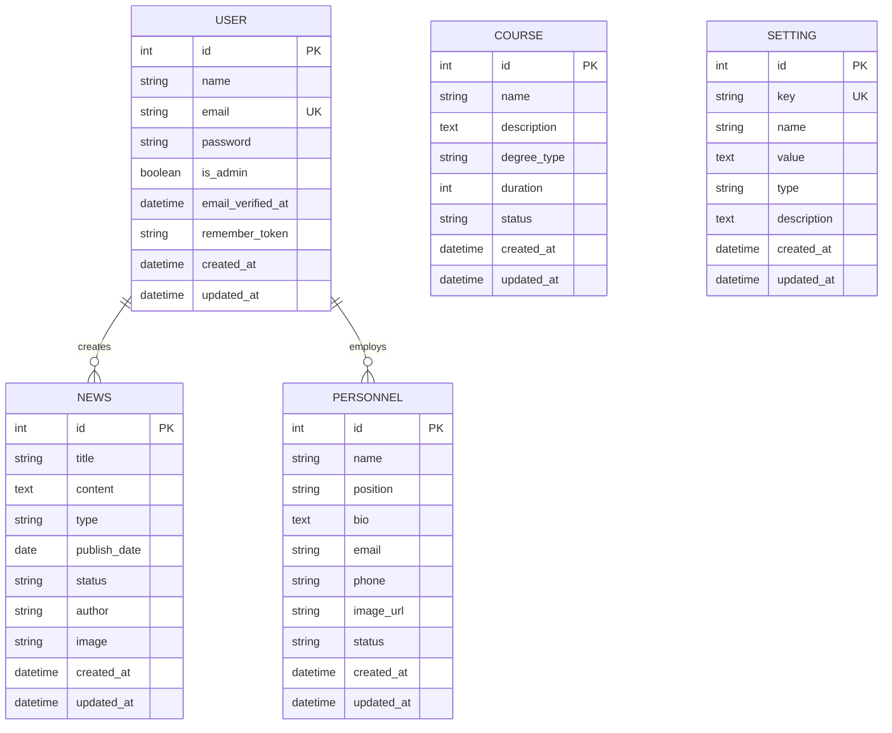

# Entity Relationship Diagram

## Entities and Attributes

### User
- id (Primary Key)
- name
- email (Unique)
- password
- is_admin (boolean)
- email_verified_at
- remember_token
- created_at
- updated_at

### News
- id (Primary Key)
- title
- content
- type (ข่าวสาร, กิจกรรม)
- publish_date
- status (ร่าง, เผยแพร่)
- author
- image
- created_at
- updated_at

### Course
- id (Primary Key)
- name
- description
- degree_type (ปริญญาตรี, ปริญญาโท)
- duration
- status (เปิดรับ, ปิดรับ)
- created_at
- updated_at

### Personnel
- id (Primary Key)
- name
- position
- bio
- email
- phone
- image_url
- status (ทำงาน, ลาออก)
- created_at
- updated_at

### Setting
- id (Primary Key)
- key (Unique)
- name
- value
- type (string, text, boolean, integer, etc.)
- description
- created_at
- updated_at

## Relationships

