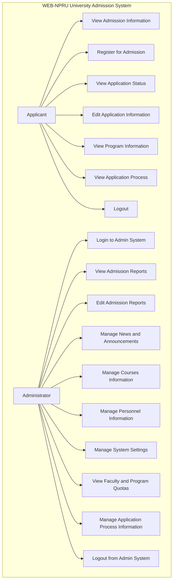

# Use Case Diagram

## System Overview

The WEB-NPRU University Admission System consists of two main user types:
- **Applicant**: A prospective student who wishes to apply for admission to the university
- **Administrator**: A university staff member who manages the admission process and system

## Use Case Diagram

## Use Case Descriptions

### Applicant Use Cases

#### UC-01: View Admission Information
- **Goal**: View general admission information and requirements
- **Actors**: Applicant
- **Preconditions**: None
- **Main Flow**:
  1. Applicant accesses the university website
  2. System displays homepage with admission information
  3. Applicant navigates to admission section
  4. System displays admission requirements and process information

#### UC-02: Register for Admission
- **Goal**: Complete the admission registration process
- **Actors**: Applicant
- **Preconditions**: Applicant has necessary documentation
- **Main Flow**:
  1. Applicant navigates to admission registration page
  2. System displays registration form
  3. Applicant fills in personal information
  4. Applicant fills in educational background
  5. Applicant submits form
  6. System validates information
  7. System creates applicant account
  8. System logs applicant in automatically
  9. System redirects applicant to dashboard

#### UC-03: View Application Status
- **Goal**: Check the status of their application
- **Actors**: Applicant
- **Preconditions**: Applicant is logged in
- **Main Flow**:
  1. Applicant accesses dashboard
  2. System displays application summary
  3. Applicant views application status
  4. System displays current status and next steps

#### UC-04: Edit Application Information
- **Goal**: Update application information after initial submission
- **Actors**: Applicant
- **Preconditions**: Applicant is logged in and has submitted an application
- **Main Flow**:
  1. Applicant accesses dashboard
  2. System displays application summary
  3. Applicant selects "Edit Information" option
  4. System displays editable application form
  5. Applicant updates information
  6. Applicant submits updated information
  7. System validates and saves changes
  8. System confirms successful update

#### UC-05: View Program Information
- **Goal**: View information about available programs and quotas
- **Actors**: Applicant
- **Preconditions**: None
- **Main Flow**:
  1. Applicant navigates to program information page
  2. System displays list of faculties
  3. Applicant selects a faculty
  4. System displays programs in that faculty
  5. System shows quota information for each program

#### UC-06: View Application Process
- **Goal**: Understand the step-by-step application process
- **Actors**: Applicant
- **Preconditions**: None
- **Main Flow**:
  1. Applicant navigates to application process page
  2. System displays step-by-step guide
  3. Applicant reviews each step of the process

#### UC-07: Logout
- **Goal**: End their session securely
- **Actors**: Applicant
- **Preconditions**: Applicant is logged in
- **Main Flow**:
  1. Applicant selects "Logout" option
  2. System invalidates session
  3. System redirects to homepage

### Administrator Use Cases

#### UC-08: Login to Admin System
- **Goal**: Access the administrative dashboard
- **Actors**: Administrator
- **Preconditions**: Administrator has valid credentials
- **Main Flow**:
  1. Administrator navigates to admin login page
  2. System displays login form
  3. Administrator enters credentials
  4. Administrator submits form
  5. System validates credentials
  6. System redirects to admin dashboard

#### UC-09: View Admission Reports
- **Goal**: View reports on admission applications
- **Actors**: Administrator
- **Preconditions**: Administrator is logged in
- **Main Flow**:
  1. Administrator accesses admission report page
  2. System displays summary statistics
  3. System displays list of applicants
  4. Administrator can filter applicants by criteria
  5. Administrator can view detailed applicant information

#### UC-10: Edit Admission Reports
- **Goal**: Update admission report information
- **Actors**: Administrator
- **Preconditions**: Administrator is logged in
- **Main Flow**:
  1. Administrator accesses admission report page
  2. Administrator selects "Edit" option
  3. System displays editable report form
  4. Administrator updates statistics
  5. Administrator updates applicant information
  6. Administrator submits changes
  7. System validates and saves changes
  8. System confirms successful update

#### UC-11: Manage News and Announcements
- **Goal**: Create, edit, and delete news and announcements
- **Actors**: Administrator
- **Preconditions**: Administrator is logged in
- **Main Flow**:
  1. Administrator accesses news management page
  2. System displays list of existing news items
  3. Administrator selects to create new item or edit existing item
  4. System displays news form
  5. Administrator fills in news details
  6. Administrator submits form
  7. System validates and saves news item
  8. System confirms successful operation

#### UC-12: Manage Courses Information
- **Goal**: Create, edit, and delete course information
- **Actors**: Administrator
- **Preconditions**: Administrator is logged in
- **Main Flow**:
  1. Administrator accesses course management page
  2. System displays list of existing courses
  3. Administrator selects to create new course or edit existing course
  4. System displays course form
  5. Administrator fills in course details
  6. Administrator submits form
  7. System validates and saves course information
  8. System confirms successful operation

#### UC-13: Manage Personnel Information
- **Goal**: Create, edit, and delete personnel information
- **Actors**: Administrator
- **Preconditions**: Administrator is logged in
- **Main Flow**:
  1. Administrator accesses personnel management page
  2. System displays list of existing personnel
  3. Administrator selects to create new personnel or edit existing personnel
  4. System displays personnel form
  5. Administrator fills in personnel details
  6. Administrator submits form
  7. System validates and saves personnel information
  8. System confirms successful operation

#### UC-14: Manage System Settings
- **Goal**: Configure system-wide settings
- **Actors**: Administrator
- **Preconditions**: Administrator is logged in
- **Main Flow**:
  1. Administrator accesses system settings page
  2. System displays current settings
  3. Administrator modifies settings as needed
  4. Administrator saves changes
  5. System validates and saves settings
  6. System confirms successful update

#### UC-15: View Faculty and Program Quotas
- **Goal**: View and manage faculty and program quotas
- **Actors**: Administrator
- **Preconditions**: Administrator is logged in
- **Main Flow**:
  1. Administrator accesses faculty/program quota page
  2. System displays quota information for all programs
  3. Administrator can view detailed quota statistics
  4. Administrator can edit quota information
  5. Administrator submits changes
  6. System validates and saves quota information
  7. System confirms successful update

#### UC-16: Manage Application Process Information
- **Goal**: Update information about the application process
- **Actors**: Administrator
- **Preconditions**: Administrator is logged in
- **Main Flow**:
  1. Administrator accesses application process management page
  2. System displays current process steps
  3. Administrator can edit process steps
  4. Administrator submits changes
  5. System validates and saves process information
  6. System confirms successful update

#### UC-17: Logout from Admin System
- **Goal**: End administrative session securely
- **Actors**: Administrator
- **Preconditions**: Administrator is logged in
- **Main Flow**:
  1. Administrator selects "Logout" option
  2. System invalidates session
  3. System redirects to admin login page