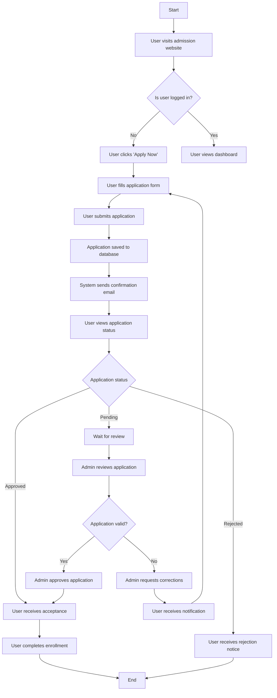

```mermaid
graph TD
    A[Start] --> B[User visits admission website]
    B --> C{Is user logged in?}
    C -->|No| D[User clicks 'Apply Now']
    C -->|Yes| E[User views dashboard]
    D --> F[User fills application form]
    F --> G[User submits application]
    G --> H[Application saved to database]
    H --> I[System sends confirmation email]
    I --> J[User views application status]
    J --> K{Application status}
    K -->|Pending| L[Wait for review]
    K -->|Approved| M[User receives acceptance]
    K -->|Rejected| N[User receives rejection notice]
    L --> O[Admin reviews application]
    O --> P{Application valid?}
    P -->|Yes| Q[Admin approves application]
    P -->|No| R[Admin requests corrections]
    R --> S[User receives notification]
    S --> F
    Q --> M
    M --> T[User completes enrollment]
    T --> U[End]
    N --> U
```