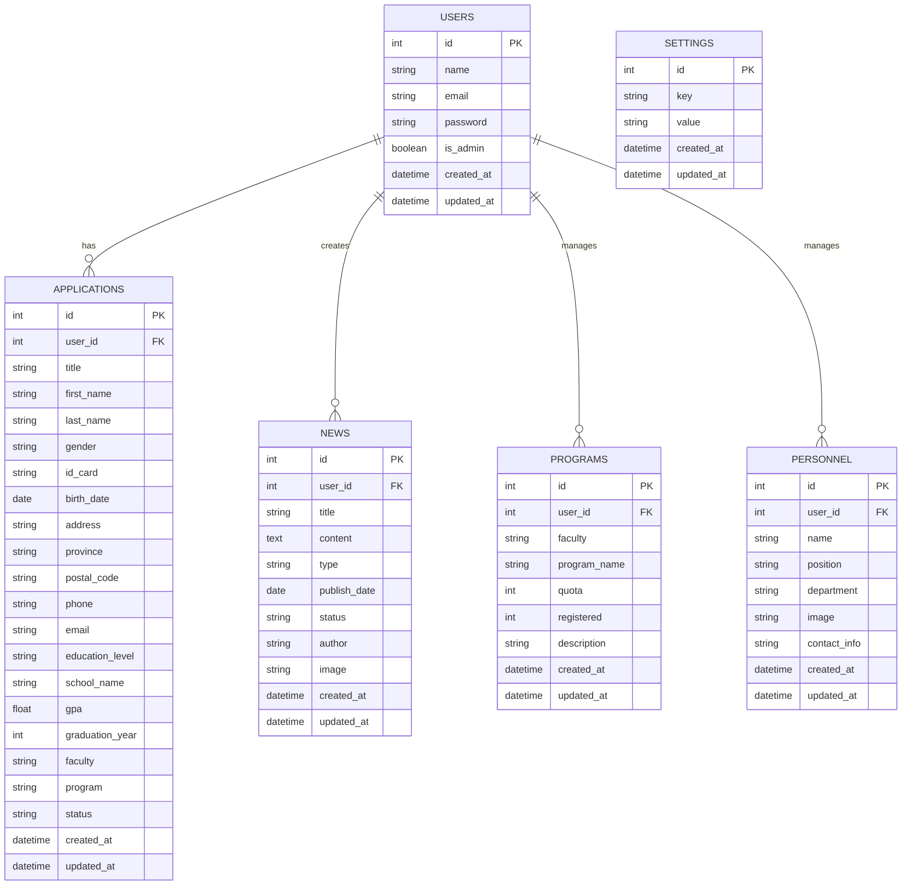
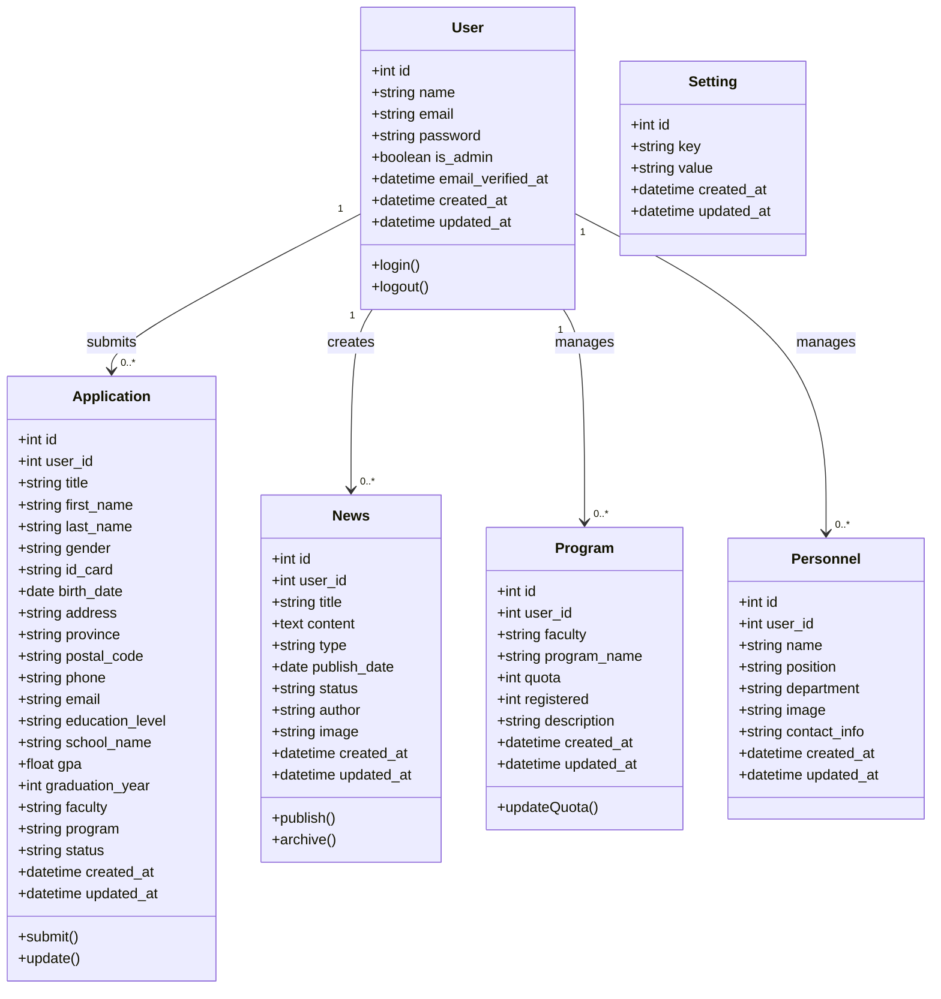
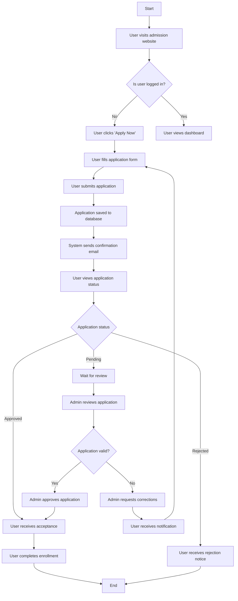

# University Admission System - UML Diagrams

## 1. Use Case Diagram

```mermaid
graph TD
    Actor1[Applicant] --> |Apply for admission| UC1[Submit Application]
    Actor1 --> |View application status| UC2[Check Application Status]
    Actor1 --> |Edit application| UC3[Update Application]
    Actor1 --> |View news| UC4[View News]
    Actor1 --> |View programs| UC5[View Programs]
    
    Actor2[Admin] --> |Manage news| UC6[Create News]
    Actor2 --> |Manage news| UC7[Edit News]
    Actor2 --> |Manage news| UC8[Delete News]
    Actor2 --> |Manage applications| UC9[Review Applications]
    Actor2 --> |Manage programs| UC10[Manage Programs]
    Actor2 --> |View reports| UC11[View Reports]
    Actor2 --> |Manage users| UC12[Manage Users]
    
    subgraph "Applicant Functions"
        UC1
        UC2
        UC3
        UC4
        UC5
    end
    
    subgraph "Admin Functions"
        UC6
        UC7
        UC8
        UC9
        UC10
        UC11
        UC12
    end
```

## 2. ER Diagram

```mermaid
erDiagram
    USERS ||--o{ APPLICATIONS : has
    USERS ||--o{ NEWS : creates
    USERS ||--o{ PROGRAMS : manages
    USERS ||--o{ PERSONNEL : manages
    
    USERS {
        int id PK
        string name
        string email
        string password
        boolean is_admin
        datetime created_at
        datetime updated_at
    }
    
    APPLICATIONS {
        int id PK
        int user_id FK
        string title
        string first_name
        string last_name
        string gender
        string id_card
        date birth_date
        string address
        string province
        string postal_code
        string phone
        string email
        string education_level
        string school_name
        float gpa
        int graduation_year
        string faculty
        string program
        string status
        datetime created_at
        datetime updated_at
    }
    
    NEWS {
        int id PK
        int user_id FK
        string title
        text content
        string type
        date publish_date
        string status
        string author
        string image
        datetime created_at
        datetime updated_at
    }
    
    PROGRAMS {
        int id PK
        int user_id FK
        string faculty
        string program_name
        int quota
        int registered
        string description
        datetime created_at
        datetime updated_at
    }
    
    PERSONNEL {
        int id PK
        int user_id FK
        string name
        string position
        string department
        string image
        string contact_info
        datetime created_at
        datetime updated_at
    }
    
    SETTINGS {
        int id PK
        string key
        string value
        datetime created_at
        datetime updated_at
    }
```

## 3. Class Diagram

```mermaid
classDiagram
    class User {
        +int id
        +string name
        +string email
        +string password
        +boolean is_admin
        +datetime email_verified_at
        +datetime created_at
        +datetime updated_at
        +login()
        +logout()
    }
    
    class Application {
        +int id
        +int user_id
        +string title
        +string first_name
        +string last_name
        +string gender
        +string id_card
        +date birth_date
        +string address
        +string province
        +string postal_code
        +string phone
        +string email
        +string education_level
        +string school_name
        +float gpa
        +int graduation_year
        +string faculty
        +string program
        +string status
        +datetime created_at
        +datetime updated_at
        +submit()
        +update()
    }
    
    class News {
        +int id
        +int user_id
        +string title
        +text content
        +string type
        +date publish_date
        +string status
        +string author
        +string image
        +datetime created_at
        +datetime updated_at
        +publish()
        +archive()
    }
    
    class Program {
        +int id
        +int user_id
        +string faculty
        +string program_name
        +int quota
        +int registered
        +string description
        +datetime created_at
        +datetime updated_at
        +updateQuota()
    }
    
    class Personnel {
        +int id
        +int user_id
        +string name
        +string position
        +string department
        +string image
        +string contact_info
        +datetime created_at
        +datetime updated_at
    }
    
    class Setting {
        +int id
        +string key
        +string value
        +datetime created_at
        +datetime updated_at
    }
    
    User "1" --> "0..*" Application : submits
    User "1" --> "0..*" News : creates
    User "1" --> "0..*" Program : manages
    User "1" --> "0..*" Personnel : manages
```

## 4. Activity Diagram

```mermaid
graph TD
    A[Start] --> B[User visits admission website]
    B --> C{Is user logged in?}
    C -->|No| D[User clicks 'Apply Now']
    C -->|Yes| E[User views dashboard]
    D --> F[User fills application form]
    F --> G[User submits application]
    G --> H[Application saved to database]
    H --> I[System sends confirmation email]
    I --> J[User views application status]
    J --> K{Application status}
    K -->|Pending| L[Wait for review]
    K -->|Approved| M[User receives acceptance]
    K -->|Rejected| N[User receives rejection notice]
    L --> O[Admin reviews application]
    O --> P{Application valid?}
    P -->|Yes| Q[Admin approves application]
    P -->|No| R[Admin requests corrections]
    R --> S[User receives notification]
    S --> F
    Q --> M
    M --> T[User completes enrollment]
    T --> U[End]
    N --> U
```