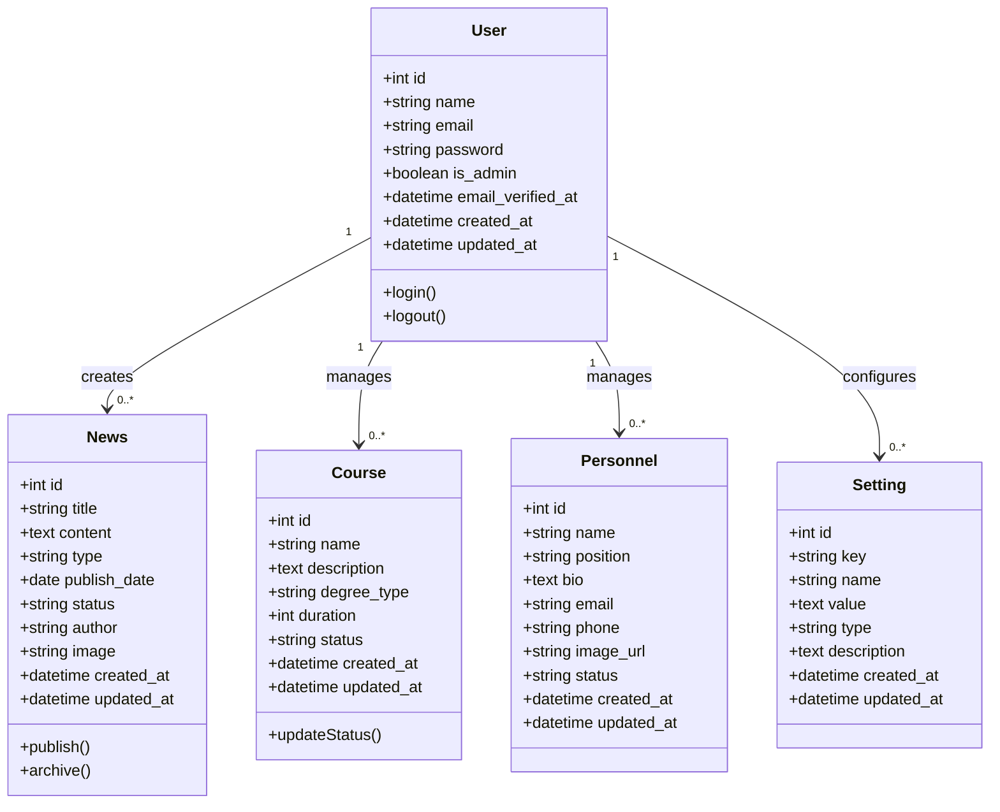

```mermaid
classDiagram
    class User {
        +int id
        +string name
        +string email
        +string password
        +boolean is_admin
        +datetime email_verified_at
        +datetime created_at
        +datetime updated_at
        +login()
        +logout()
    }
    
    class News {
        +int id
        +string title
        +text content
        +string type
        +date publish_date
        +string status
        +string author
        +string image
        +datetime created_at
        +datetime updated_at
        +publish()
        +archive()
    }
    
    class Course {
        +int id
        +string name
        +text description
        +string degree_type
        +int duration
        +string status
        +datetime created_at
        +datetime updated_at
        +updateStatus()
    }
    
    class Personnel {
        +int id
        +string name
        +string position
        +text bio
        +string email
        +string phone
        +string image_url
        +string status
        +datetime created_at
        +datetime updated_at
    }
    
    class Setting {
        +int id
        +string key
        +string name
        +text value
        +string type
        +text description
        +datetime created_at
        +datetime updated_at
    }
    
    User "1" --> "0..*" News : creates
    User "1" --> "0..*" Course : manages
    User "1" --> "0..*" Personnel : manages
    User "1" --> "0..*" Setting : configures
```