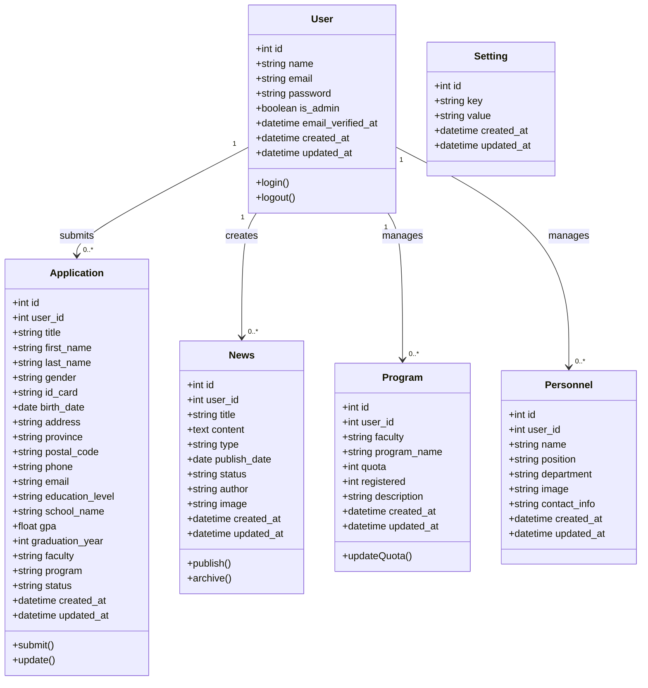

```mermaid
classDiagram
    class User {
        +int id
        +string name
        +string email
        +string password
        +boolean is_admin
        +datetime email_verified_at
        +datetime created_at
        +datetime updated_at
        +login()
        +logout()
    }
    
    class Application {
        +int id
        +int user_id
        +string title
        +string first_name
        +string last_name
        +string gender
        +string id_card
        +date birth_date
        +string address
        +string province
        +string postal_code
        +string phone
        +string email
        +string education_level
        +string school_name
        +float gpa
        +int graduation_year
        +string faculty
        +string program
        +string status
        +datetime created_at
        +datetime updated_at
        +submit()
        +update()
    }
    
    class News {
        +int id
        +int user_id
        +string title
        +text content
        +string type
        +date publish_date
        +string status
        +string author
        +string image
        +datetime created_at
        +datetime updated_at
        +publish()
        +archive()
    }
    
    class Program {
        +int id
        +int user_id
        +string faculty
        +string program_name
        +int quota
        +int registered
        +string description
        +datetime created_at
        +datetime updated_at
        +updateQuota()
    }
    
    class Personnel {
        +int id
        +int user_id
        +string name
        +string position
        +string department
        +string image
        +string contact_info
        +datetime created_at
        +datetime updated_at
    }
    
    class Setting {
        +int id
        +string key
        +string value
        +datetime created_at
        +datetime updated_at
    }
    
    User "1" --> "0..*" Application : submits
    User "1" --> "0..*" News : creates
    User "1" --> "0..*" Program : manages
    User "1" --> "0..*" Personnel : manages
```