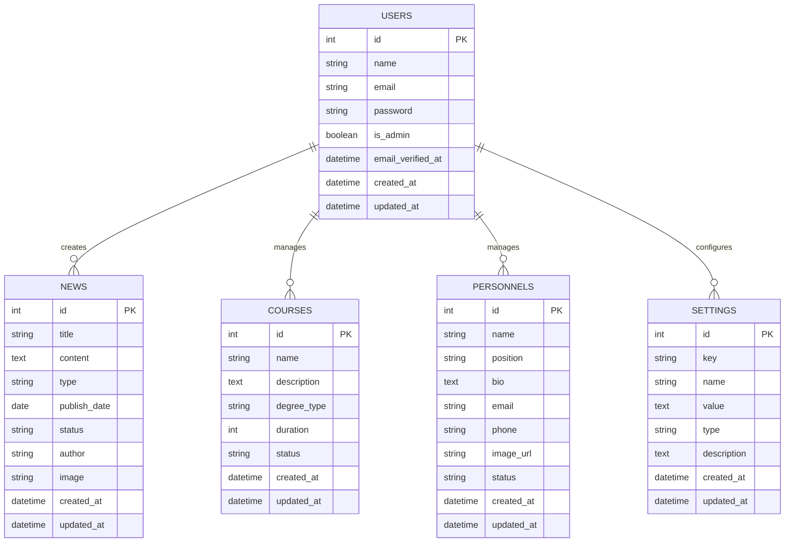

```mermaid
erDiagram
    USERS ||--o{ NEWS : creates
    USERS ||--o{ COURSES : manages
    USERS ||--o{ PERSONNELS : manages
    USERS ||--o{ SETTINGS : configures
    
    USERS {
        int id PK
        string name
        string email
        string password
        boolean is_admin
        datetime email_verified_at
        datetime created_at
        datetime updated_at
    }
    
    NEWS {
        int id PK
        string title
        text content
        string type
        date publish_date
        string status
        string author
        string image
        datetime created_at
        datetime updated_at
    }
    
    COURSES {
        int id PK
        string name
        text description
        string degree_type
        int duration
        string status
        datetime created_at
        datetime updated_at
    }
    
    PERSONNELS {
        int id PK
        string name
        string position
        text bio
        string email
        string phone
        string image_url
        string status
        datetime created_at
        datetime updated_at
    }
    
    SETTINGS {
        int id PK
        string key
        string name
        text value
        string type
        text description
        datetime created_at
        datetime updated_at
    }
```