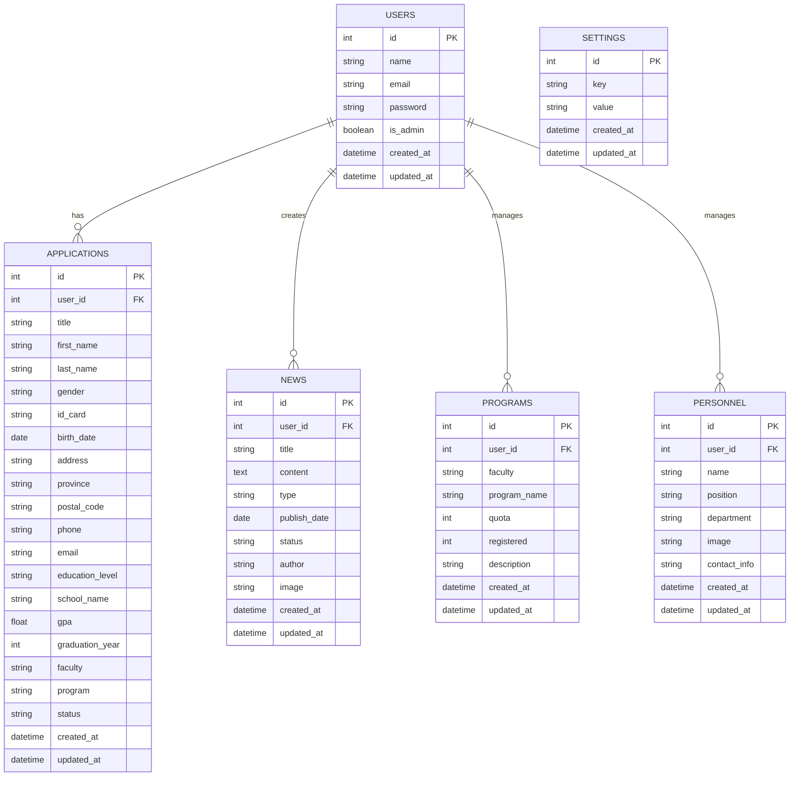

```mermaid
erDiagram
    USERS ||--o{ APPLICATIONS : has
    USERS ||--o{ NEWS : creates
    USERS ||--o{ PROGRAMS : manages
    USERS ||--o{ PERSONNEL : manages
    
    USERS {
        int id PK
        string name
        string email
        string password
        boolean is_admin
        datetime created_at
        datetime updated_at
    }
    
    APPLICATIONS {
        int id PK
        int user_id FK
        string title
        string first_name
        string last_name
        string gender
        string id_card
        date birth_date
        string address
        string province
        string postal_code
        string phone
        string email
        string education_level
        string school_name
        float gpa
        int graduation_year
        string faculty
        string program
        string status
        datetime created_at
        datetime updated_at
    }
    
    NEWS {
        int id PK
        int user_id FK
        string title
        text content
        string type
        date publish_date
        string status
        string author
        string image
        datetime created_at
        datetime updated_at
    }
    
    PROGRAMS {
        int id PK
        int user_id FK
        string faculty
        string program_name
        int quota
        int registered
        string description
        datetime created_at
        datetime updated_at
    }
    
    PERSONNEL {
        int id PK
        int user_id FK
        string name
        string position
        string department
        string image
        string contact_info
        datetime created_at
        datetime updated_at
    }
    
    SETTINGS {
        int id PK
        string key
        string value
        datetime created_at
        datetime updated_at
    }
```