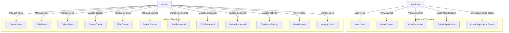

```mermaid
graph TD
    Applicant[Applicant] --> |View news| UC1[View News]
    Applicant[Applicant] --> |View courses| UC2[View Courses]
    Applicant[Applicant] --> |View personnel| UC3[View Personnel]
    Applicant[Applicant] --> |Apply for admission| UC4[Submit Application]
    Applicant[Applicant] --> |Check application status| UC5[Check Application Status]
    
    Admin[Admin] --> |Manage news| UC6[Create News]
    Admin[Admin] --> |Manage news| UC7[Edit News]
    Admin[Admin] --> |Manage news| UC8[Delete News]
    Admin[Admin] --> |Manage courses| UC9[Create Course]
    Admin[Admin] --> |Manage courses| UC10[Edit Course]
    Admin[Admin] --> |Manage courses| UC11[Delete Course]
    Admin[Admin] --> |Manage personnel| UC12[Add Personnel]
    Admin[Admin] --> |Manage personnel| UC13[Edit Personnel]
    Admin[Admin] --> |Manage personnel| UC14[Delete Personnel]
    Admin[Admin] --> |Manage settings| UC15[Configure Settings]
    Admin[Admin] --> |View reports| UC16[View Reports]
    Admin[Admin] --> |Manage users| UC17[Manage Users]
    
    subgraph "Applicant Functions"
        UC1
        UC2
        UC3
        UC4
        UC5
    end
    
    subgraph "Admin Functions"
        UC6
        UC7
        UC8
        UC9
        UC10
        UC11
        UC12
        UC13
        UC14
        UC15
        UC16
        UC17
    end
```