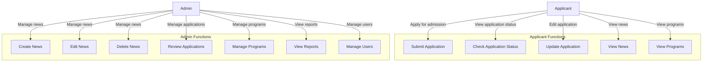

```mermaid
graph TD
    Actor1[Applicant] --> |Apply for admission| UC1[Submit Application]
    Actor1 --> |View application status| UC2[Check Application Status]
    Actor1 --> |Edit application| UC3[Update Application]
    Actor1 --> |View news| UC4[View News]
    Actor1 --> |View programs| UC5[View Programs]
    
    Actor2[Admin] --> |Manage news| UC6[Create News]
    Actor2 --> |Manage news| UC7[Edit News]
    Actor2 --> |Manage news| UC8[Delete News]
    Actor2 --> |Manage applications| UC9[Review Applications]
    Actor2 --> |Manage programs| UC10[Manage Programs]
    Actor2 --> |View reports| UC11[View Reports]
    Actor2 --> |Manage users| UC12[Manage Users]
    
    subgraph "Applicant Functions"
        UC1
        UC2
        UC3
        UC4
        UC5
    end
    
    subgraph "Admin Functions"
        UC6
        UC7
        UC8
        UC9
        UC10
        UC11
        UC12
    end
```